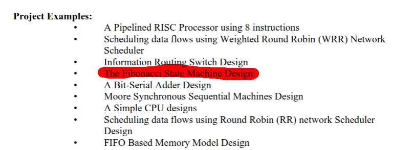
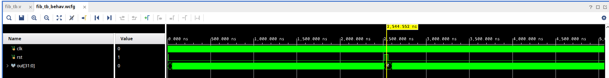
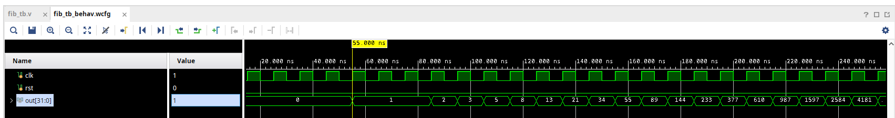
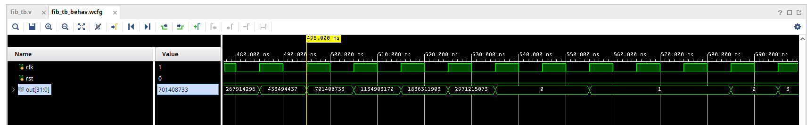

# fibonacci-hdl
Verilog HDL course project that consists of a simple Fibonacci sequence generator. This is a simple implementation of one of the design project examples from the course outline.

The tool used to create this module was Xilinx Vivado 2022.2.

This is a simple Verilog module that generates a Fibonnaci sequence up until the number "2971215073". The reason this was chosen is the output of this Fibonacci sequence generator is 32 bits wide and I wanted to prevent overflow.

After the final number in the sequence, the sequence will reset back to 0,1,1,2,3,5,...

            _________
            |       |
      clk --|       |
            |  Fib  |-- out[31:0]
            |       |
      rst --|       |
            ---------

Design code is located in `fibonacci.srcs/sources_1/new/fibonacci.v`.
Testbench code is located in `fibonacci.srcs/sim_1/new/fib_tb.v`.

## Testing Fibonacci Sequence Generator

In fib_tb.v, all I did was oscillate the clock signal and reset the module for a few cycles. Then, deassert the reset signal. Afterwards, the waveforms show the module generating a Fibonacci sequence.

## Waveforms

There are 3 waveform screenshots: Waveform_A, Waveform_B, and Waveform_C.

In Waveform_A, this is the entire waveform. This is to show that at some point, the module is reset again and it restarts the entire sequence synchronously.

In Waveform_B, this shows the start of each sequence.

In Waveform_C, this shows the end of each generated sequence after it reaches the last Fibonacci sequence number that would fit in a 32-bit register.

