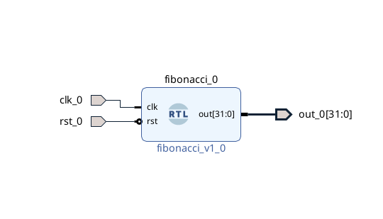
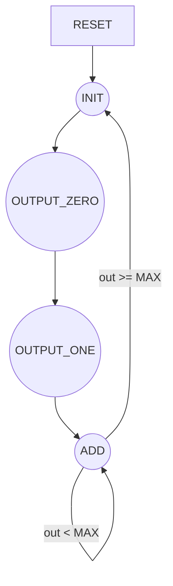

# fibonacci-hdl

## Problem Statement

For my final project in my HDL-Based Digital Systems Design course, I've chosen to design a simple Fibonacci sequence generator. As shown in the below screenshot, it is one of the design project examples from the course outline.

This is a simple Verilog module that generates a Fibonnaci sequence up until the number "2971215073". The reason this was chosen is the output of this Fibonacci sequence generator is 32 bits wide and I wanted to prevent overflow. After the final number in the sequence, the sequence will reset back to 0,1,1,2,3,5,...

The tool used to create this module was Xilinx Vivado 2022.2.
Design code is located in `fibonacci.srcs/sources_1/new/fibonacci.v`.
Testbench code is located in `fibonacci.srcs/sim_1/new/fib_tb.v`.

## Block Diagram

The following images below is a high level visualization of the HDL module. The second screenshot is an image from Vivado's block design representation of the Fibonacci module.
            _________
            |       |
      clk --|       |
            |  Fib  |-- out[31:0]
            |       |
      rst --|       |
            ---------

## State Diagram

Below is a high-level diagram of the state machine running that controls the Fibonacci generator.

### States Explained

- RESET: Represents whenever a reset signal is asserted. The state machine has an asynchronous reset, meaning the state machine will reset regardless of the clock signal. Whenever a reset happens, the state will default to the "INIT" state.

- INIT: This is the default reset state to initialize the module in a valid state. The next state after this will be the "OUTPUT_ZERO" state.

- OUTPUT_ZERO: This is the start of the Fibonacci sequence. The start of the Fibonacci sequence starts at 0 and then a 1. Therefore, the next state after this will be the "OUTPUT_ONE" state.

- OUTPUT_ONE: This is the second state at the start of the Fibonacci sequence. We have to manually inject a 0 and a 1 in the start of the sequence to start the recursion process. The next state after this will be the "ADD" state.

- ADD: Now that a 0 and 1 are put in the sequence, now we can start recusively continuing the Fibonacci sequence. The Fibonacci sequence is simply a recursive process where each number is a sum of the previous two numbers. Now that we have our first 2 numbers, we can simply make each number a sum of the previous 2 (0, 1, 1, 2, 3, 5, 8...). The sequence will continue until the number "2971215073" is reached, which is the last number that can fit within a 32-bit register. After the number is reached, the next state will be "OUTPUT_ZERO", looping the state machine back to the start of the Fibonacci sequence.

## Testing Fibonacci Sequence Generator

In fib_tb.v, all I did was oscillate the clock signal and reset the module for a few cycles. Then, deassert the reset signal. Afterwards, the waveforms show the module generating a Fibonacci sequence.

There are 3 waveform screenshots: Waveform_A, Waveform_B, and Waveform_C.

In Waveform_A, this is the entire waveform. This is to show that at some point, the module is reset again and it restarts the entire sequence synchronously.

In Waveform_B, this shows the start of each sequence.

In Waveform_C, this shows the end of each generated sequence after it reaches the last Fibonacci sequence number that would fit in a 32-bit register.

